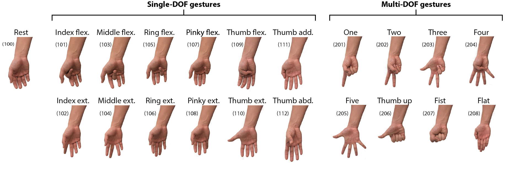

## FlexEMG_V2: A wearable biosensing system with printed flexible electrodes and in-sensor adaptive learning

This repository provides the offline dataset and MATLAB scripts used to verify the data acquision functionality of our device and the utilized algorithm. It is publicly available under GNU General Public License v3.

### System requirements
- MATLAB (MathWorks, Inc.). Tested on version R2019a.

### Installation guide
Install MATLAB, add the whole **`flexemg_v2/`** directory to the path, and you are ready to go!

### Repo structure
Note that all scripts are commented with function descriptions, input arguments, returns, etc.

- **`dataset/`**: Dataset containing raw EMG signals from 5 subjects and 21 hand gestures with 5 repeatitions  of each.
- **`functions/`**: MATLAB functions to emulate the HD algorithm being run on the on-board FPGA.

### Filename structure
The files are named as `"sss_e_ggg_t.mat"` where `sss` is the subject number, `e` is the experiment number, `ggg` is the gesture ID, and `t` is the trail number.
The list of experimetns is as follows:
| Experiments |   Gestures   |                 Context                |
|:-------:|:------------:|:--------------------------------------:|
|    1    |  Single-DOF  |     Baseline, relaxed arm position     |
|    2    |   Multi-DOF  |     Baseline, relaxed arm position     |
|    3    |  Single-DOF  |     New arm position (arm wrestle)     |
|    4    | Effort level |    Low effort, relaxed arm position    |
|    5    | Effort level |   Medium effort, relaxed arm position  |
|    6    | Effort level |    High effort, relaxed arm position   |
|    7    |  Single-DOF  | New wear session, relaxed arm position |
|    8    |  Single-DOF  |  Prolonged wear, relaxed arm position  |

The list of gesture IDs is listed here:

### Sample usage

To find the classification accuracy for subject 1 without using parallel computing toolbox, all you need to do is running `all_expermients` function in the following way:

> `all_expermients(1, 0)`

The results will be saved in **`output/`** folder with classification accuracy results for each run.

### Problems?
If you face any problems or discover any bugs, please let us know: *MyLastName AT berkeley DOT edu*
